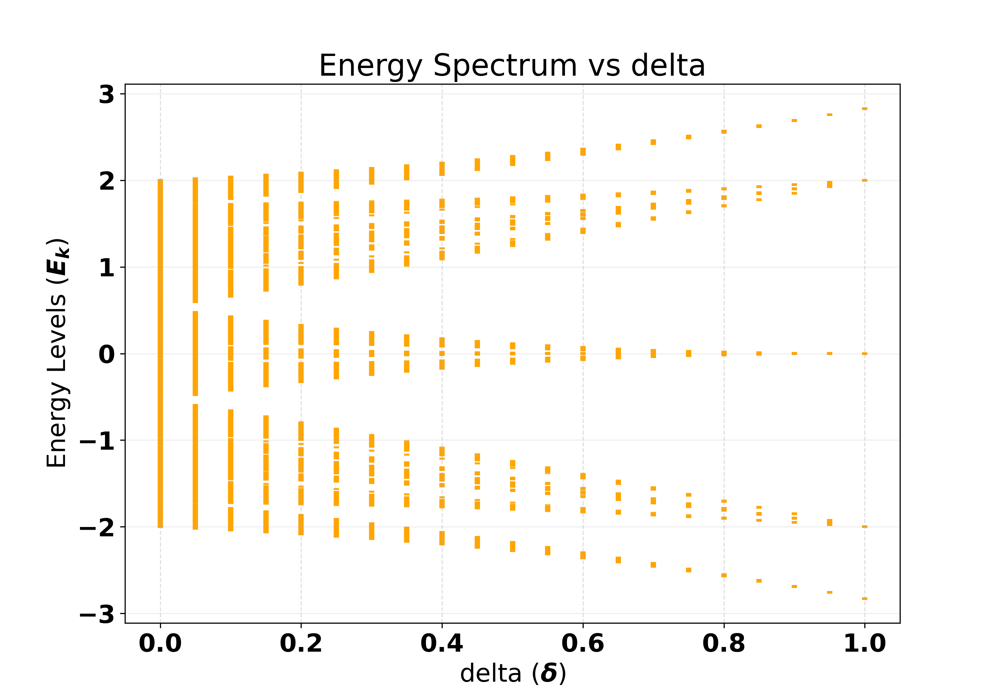

# Free Fermions on Fibonacci and Other Aperiodic Chains

Code for my Bachelor's thesis, *"Band theory and entanglement in disordered non-random free fermionic chains"* (Bachelor Degree in Engineering Physics, Universidad Carlos III de Madrid, 2026). Supervised by Silvia Noemí Santalla Arribas.

## About

Quasiperiodic chains sit between periodic order and random disorder. They don't satisfy the conditions of Bloch's theorem and they don't show Anderson localization, so they form their own critical class. The Jordan-Wigner transformation maps the XX spin-1/2 chain onto free spinless fermions. Because of that, the results here also apply to quantum spin chains.

This project studies 1D free-fermion tight-binding chains,

$$H = -\sum_{i=1}^{N-1} J_i \left(c_i^\dagger c_{i+1} + \text{h.c.}\right),$$

where the hoppings follow deterministic aperiodic substitution sequences: $J_i = J(1+\delta)$ for a `1` and $J_i = J(1-\delta)$ for a `0`. The main question is whether the spectral and entanglement properties of the Fibonacci chain are unique to it or shared by other substitution chains. To test this, the thesis introduces the **5-7 chain** ($A \to ABABA$, $B \to ABABABA$). It is built to copy Fibonacci's cluster structure, but with blocks of length 5 and 7 instead of 3 and 5.

Main results ($\delta = 0.3$):

| Chain     | Spectrum                | IPR exponent α | Entanglement entropy        |
|-----------|-------------------------|----------------|-----------------------------|
| Clean     | Uniform, gapless        | 1              | Logarithmic (c = 1)         |
| Dimerized | Gapped (ΔE = 4Jδ)       | 1              | Area law                    |
| Rainbow   | Clustered around E = 0  | 0              | Volume law                  |
| Random    | Continuous, dense       | ≈ 0            | Area law                    |
| Fibonacci | Cantor-like, gapless    | 0.761          | Logarithmic with serrations |
| 5-7       | Cantor-like, gapless    | 0.694          | Logarithmic with serrations |

Both aperiodic chains have a fractal spectrum, critical localization (0 < α < 1), no energy gap, and a logarithmic entanglement entropy. The serrations in the entropy, and the patterns along the off-diagonals of the correlation matrix, reproduce the underlying sequence. This supports the conjecture that these features are common to substitution-generated aperiodic chains and not specific to Fibonacci.



*Energy spectrum of the Fibonacci chain (N = 1598) as the modulation δ goes from 0 to 1. At δ = 0 it is the clean band [−2, 2]. As δ grows, the band splits into a hierarchy of sub-bands. At δ = 1 the weak bonds vanish and the chain breaks into isolated dimers and trimers, so the spectrum collapses onto their eigenvalues: E = ±2 (dimers) and E = 0, ±2√2 (trimers).*

## What it computes

For each chain, the program builds the N×N hopping matrix with open boundary conditions, diagonalizes it exactly, and fills the N/2 lowest modes (half filling). From that it computes:

- **Energy spectrum and density of states**: single-particle eigenvalues, including their dependence on N and on δ.
- **Correlation matrix** $C_{ij} = \langle c_i^\dagger c_j \rangle = U_\text{occ} U_\text{occ}^\dagger$.
- **Ground-state probability density** and **inverse participation ratio** (IPR ∝ N^−α).
- **Energy gap** at the Fermi level, ε(N/2+1) − ε(N/2), as a function of N and of δ.
- **Entanglement entropy** S(l) of the leftmost l sites. It is computed from the eigenvalues of the restricted correlation matrix (Wick's theorem / Peschel's method). The program also gives the half-chain S(N/2) as a function of N, which is used to fit the effective central charge.

Supported chains (the `chain` variable in [src/main.cpp](src/main.cpp)): `uniform`, `dimerized`, `rainbow`, `random`, `fibonacci`, `sturmian`, `fib_57`, plus the experimental `fib_59` and `fib_711`.

## Repository layout

```
src/main.cpp                      Simulation driver: parameters and which observables to compute
include/Functions_Computation.h   Chain Hamiltonians and observables (correlation, IPR, EE, gap…)
include/*.cc, *.h                 HVB library by J. Rodríguez-Laguna (linear algebra, plotting)
data_processing.py                Python/Matplotlib plotting of the simulation output
data/                             Simulation output (git-ignored); data/sample/ holds small example files
figures/                          Figures used in this README
```

## Building

Requirements: `g++`, `make`, LAPACK, BLAS, X11 and Imlib2. On Debian/Ubuntu:

```bash
sudo apt install build-essential liblapack-dev libblas-dev libx11-dev libimlib2-dev
```

Build and run:

```bash
make            # builds bin/simulation
./bin/simulation
make clean      # removes the binary and object files
```

The program writes its results as plain-text files into `data/` (create the folder first with `mkdir -p data`). Choose the chain, size `N`, modulation `sigma` (δ in the thesis) and other parameters at the top of [src/main.cpp](src/main.cpp). Turn individual calculations on or off in `main()`.

## Plotting

```bash
pip install numpy matplotlib
mkdir -p images
python data_processing.py
```

This reads the files in `data/` and saves the figures to `images/`.

## License

Code: MIT. The thesis text is licensed under CC BY-NC-ND 4.0. The HVB library is © J. Rodríguez-Laguna under its own MIT license ([github.com/jvrlag/hvb](https://github.com/jvrlag/hvb)).
